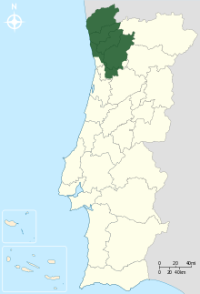

```{r setup, echo=FALSE, message=FALSE}
knitr::opts_chunk$set(echo = TRUE)

#Load some libraries
library(vtable)
library(kableExtra)
library(tidyr)
library(ggplot2)
library(ggcorrplot)

#Import Data
ProjectData <- read.csv("winequality-red.csv") 
#Max Number of Data to Show in table later
max_data_report = 10
# Enter the original raw attributes to use in table later
factor_attributes_used= c(1:10)

```

## What is this for?

**Premise:** Wine production is a highly risky and costly endeavor. Producers are at the mercy of many variables; from changing climates to varying input costs. Overall though, any winemaker's priority remains that of making a wine that will please the end-customer. While customers' perceptions of quality will naturally be subjective, this study aims to identify whether there are some physiochemical properties of wines that are typically associated with good quality.

**Why this matters?** The phsyiochemical properties of a wine can be identified and altered at different stages of the production process (with different cost implications). In turn, identifying a target of properties towards which a wine producer should work to make a good quality wine can allow for better risk and quality management. Furthermore, given good quality wines are unlikely to be associated with a single set of properties, this project may also help identify multiple clusters of properties that make a good wine. This may prove valuable in a marketing setting. A wine producer may in fact decide what properties to target to produce a wine that aligns well with a cluster in customers' perceptual maps. This analysis may also allow a producer to identify a high-quality niche with a sparser competition.

**What Properties Can Be Changed:** Not all physiochemical properties of a wine can be changed, with the best wines typically being associated with a specific mix of grapes, climate and earth. Nonetheless, some properties associated with higher quality can be controlled in production. Some examples include: sulphates, alcohol concentration, volatile acidity and pH. Sulphates can be added to a wine to allow for better conservation and reduced oxidation. Alcohol concentration in a wine will often be a product of outside temperatures. More alcoholic wines can be more rounded and supple than low-alcohol ones. Alcohol concentration though can be changed by a producer; added sugar, for instance, allows for higher alcohol concentration. Volatile aciditiy can be changed via the maloactic fermentation process. This is a controlled process where bacteria convert malic acid into lactic acid and carbon dioxide, giving wines a less acid and more buttery taste. Finally, pH is often changed via the addition of tartaric acid.

## High-Level Data Description

**Source:** The dataset is imported from [Kaggle](https://www.kaggle.com/datasets/uciml/red-wine-quality-cortez-et-al-2009), which in turn relies on a paper by [Cortez et. al](https://www.sciencedirect.com/science/article/pii/S0167923609001377) pubblished in 2009. The dataset contains 1599 red wines from Portugal of the Vinho Verde category. Vinho Verde is a DOC label rather than a grape variety. These wines typically originate from the Minho province in the north of Portugal. The region is renowned for having numerous small producers. Vinho Verde wines are usually had "young", meaning they are sold anywhere between three and six months after a harvest. These wines are renowned for having a slight effervescence.

<center>

</center>

## What is the Business Question?

This project aims to answer two questions crucial to wine producers:

1. **What physiochemical qualities should one target to produce what is typically deemed a good quality wine?** Are there are any different combinations of properties that make a good quality wine?

2. **How does one estimate the likely quality of their wine based on laboratory testing?** A wine's physiochemical properties are typically identified at a certification stage. Here, an oenologist will also conduct a subjective assessment of quality based on taste. Estimating the likely quality score ahead of time can be a useful risk management tool for a producer ahead of certification.

**Further Analysis:** This dataset focuses specifically on the Vinho Verde wines and results may not be generalized to other wine types. Nonetheless, this project also aims to provide a framework for future research in other wine types. Furthermore, due to privacy reasons the data currently does not include information on producers, grape types used or prices. Further studies in this field may look to enrich the dataset to include this information. Prices may prove particularly valuable given specific physiochemical properties may be used to design a pricing model for producers to rely on.

## How Do We Hope to Address the Business Question?

1) **Question 1:** Conduct clustering and segmentation analysis to identify different good quality wine families. Here, a family is defined as a set of unique phsyiochemical properties.

2) **Question 2:** Utilize different supervised learning techniques to construct a model that estimates a wine's quality based on a set of phsyiochemical properties. Here, models will look at identifying variable importance too.

In light of the above analysis, the intent is to create the following use cases:

1. **Market Analysis:** The approach pursued in Question 1 will allow us to construct a set of "ideal" physchiochemical properties for producers to target. A producer with a low quality wine keen to increase the attractiveness of their wine may decide to alter some physiochemical properties to reach this "ideal" zone. This market analysis may also allow producers to have a better sense of areas where competition is limited (good quality wines with a given set of physiochemical properties and few competitors), and hence that are worth targeting.

In theory, the value of this market analysis could be quantified empirically. A wine producer who has a wine with a quality rating of 4 and who successfully raises the wine quality to 5 by changing some physiochemical properties may quantify the return in the following way:
<center>
**(Profit at Wine Rating of 5) - (Profit at Wine Rating of 4) - (Cost of Change in Physiochemical Properties)**
</center>
Naturally, the above assumes that a producer would obtain a higher profit from a higher quality wine. This higher profit may be a result of the producer: a) selling more wine, b) managing to raise the price of the wine due to its higher quality or c) doing both. The above also assumes that a jump in quality rating is indeed possible by altering physiochemical properties only.

2. **Supporting Producers Ahead of Certification:** Winemakers regularly have to ask oenologists to test and certify the quality of their wines. Having a model at hand that allows producers to understand an estimated quality rating of their wine ahead of certification may allow producers to tweak their physiochemical properties to obtain a higher rating and a better product. More specifically, this model may be used by producers in a laboratory environment where producers may input the test results in a function and automatically get an estimate of their quality rating. Following this estimate, producers may work to change the properties of their wine by, for instance, altering the fermentation or adding sulphites.

3. **Support the Oenological Community:** A model that assigns a quality rating based on a set of physiochemical properties may also prove useful to oenologists, who will be able to have a second opinion on their subjective taste.

## Understanding the Data

The dataset contains 1600 rows and 12 columns, with each row signifying an unnamed wine. 11 of these columns are based on objective testing in a laboratory environment, while the quality column is based on a subjective assessment by an oenologist at certification. The below information is derived from [Kaggle](https://www.kaggle.com/datasets/uciml/red-wine-quality-cortez-et-al-2009) and [Cortez et. al 2009](https://www.sciencedirect.com/science/article/pii/S0167923609001377).

1. **Fixed Acidity:** Most acids involved with wine that are fixed or nonvolatile (i.e. do not evaporate readily).
2. **Volatile Aciditiy:** The amount of acetic acid in wine, which at too high levels can lead to an unpleasant, vinegar taste.
3. **Citric Acid:** Found in small quantities, citric acid can add 'freshness' and flavor to wines.
4. **Residual Sugar:** The amount of sugar remaining after fermentation stops. Wines with greater than 45 grams/liter are considered sweet.
5. **Chlorides:** The amount of salt in the wine.
6. **Free Sulfur Dioxide:** The free form of SO2 that exists in equilibrium between molecular SO2 (as a dissolved gas) and bisulfite ion. This prevents microbial growth and the oxidation of wine.
7. **Total Sulfur Dioxide:** The amount of free and bound forms of S02. In low concentrations SO2 is mostly undetectable in wine, but at free SO2 concentrations over 50 ppm, SO2 becomes evident in the nose and taste of wine.
8. **Density:** How close the density is to that of water depending on the percent of alcohol and sugar content.
9. **pH:** This describes how acidic or basic a wine is on a scale from 0 (very acidic) to 14 (very basic). Most wines are between 2.5-4 on the pH scale.
10. **Sulphates:** A wine additive which can contribute to sulfur dioxide gas (S02) levels. Sulphates act as a antimicrobial and antioxidant.
11. **Alcohol:** The percent of alcohol content of the wine.
12. **Quality:** An output variable based on sensory data; scores vary between 0 and 10.

The below table shows how the first `r min(max_data_report, nrow(ProjectData))` observations look like.

```{r, echo=FALSE, message=FALSE}

#Produce Example Table with 10 rows
factor_attributes_used = unique(sapply(factor_attributes_used,function(i) min(ncol(ProjectData), max(i,1))))
ProjectDataFactor=ProjectData[,factor_attributes_used]
ProjectDataFactor <- data.matrix(ProjectDataFactor)
rownames(ProjectDataFactor) <- paste0("observation ", sprintf("%02i", 1:nrow(ProjectDataFactor)))
knitr::kable(round(ProjectDataFactor, 2)[1:min(max_data_report,nrow(ProjectDataFactor)), ])

```

The table below shows some summary statistics for the 12 variables in the set. Some variables may necessitate scaling given their means differ significantly. This step will be considered at later stages of the project, depending on whether large variables are driving the results to an excessive extent.

It is worth noting that while quality is based on a scale from 0 to 10, the dataset has a minimum value of 3 and a maximum of 8. This may mean there are no exceptionally bad or exceptionally good wines.

```{r, echo=FALSE, message=FALSE}
#Produce Summary Table
st(ProjectData)

```

Violin plots allow for a better visualization of the distributions of each variable. Most wines seem to have a quality rating of either 5 or 6, with the distribution of ratings having a positive skew. Chlorides and residual sugar have a narrow distribution although there are some significant outliars on the right tail to take into account.

```{r, echo=FALSE, message=FALSE}
#Violin/Box plot or curve to show distribution

Boxplotdata <- ProjectData %>% 
  gather(symbol, variable)

Violin <- ggplot(Boxplotdata, aes(symbol, variable))+
  geom_violin()+
  facet_wrap(.~symbol, scales = "free")

Violin

```

When looking at a correlogram, wine quality seems positively correlated with alcohol concentration and negatively correlated to volatile acidity. As expected, total sulfur dioxide and free sulfur dioxide are strongly correlated with each other. Fixed acidity is also strongly correlated with citric acidity and density.

One should note that pH is a measure of acidity, with a pH below 7 implying acidity. Most wines fall in the 2.5 to 4 pH range. Naturally, pH is negatively correlated with fixed acidity (lower pH implies higher acidity). Some degree of multicollinearity is likely to exist here.

```{r, echo=FALSE, message=FALSE}
# Create Correlation Matrix in Chart Format
corr <- round(cor(ProjectData), 1)

# Plot
ggcorrplot(corr, hc.order = TRUE, 
           type = "lower", 
           lab = TRUE, 
           lab_size = 3, 
           method="circle", 
           colors = c("tomato2", "white", "springgreen3"), 
           title="Correlogram of Wine Variables", 
           ggtheme=theme_bw)
```

Another important data visualisation looks at plotting quality against each of the remaining 11 phsyiochemical components (quality is placed on the x-axis and the physiochemical component on the y-axis). Again, alcohol concentration shows the strongest correlation with quality.

```{r, echo=FALSE, message=FALSE}
#Facet wrap in relation to quality

Facetwrapchart <- ProjectData %>% 
  gather(symbol, variable, -quality) %>% 
  ggplot(aes(x = quality, y = variable, color = symbol)) +
  geom_point(alpha = 0.5) +
  facet_wrap(~symbol, scales = "free")+
  geom_smooth(method = "lm", se=FALSE, color="black", formula = y ~ x) 

Facetwrapchart
```

